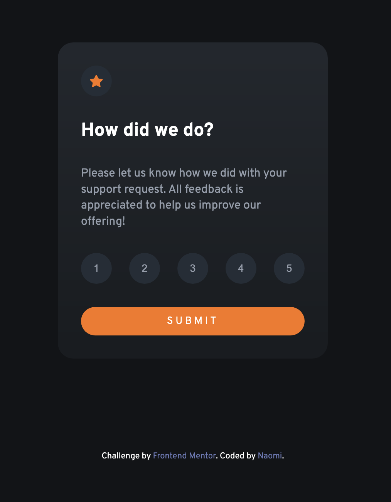

# Frontend Mentor - Interactive rating component solution

This is a solution to the [Interactive rating component challenge on Frontend Mentor](https://www.frontendmentor.io/challenges/interactive-rating-component-koxpeBUmI). Frontend Mentor challenges help you improve your coding skills by building realistic projects. 

## Table of contents

- [Overview](#overview)
  - [The challenge](#the-challenge)
  - [Screenshot](#screenshot)
  - [Links](#links)
- [My process](#my-process)
  - [Built with](#built-with)
  - [What I learned](#what-i-learned)
  - [Continued development](#continued-development)
- [Author](#author)

## Overview

### The challenge

Users should be able to:

- View the optimal layout for the app depending on their device's screen size
- See hover states for all interactive elements on the page
- Select and submit a number rating
- See the "Thank you" card state after submitting a rating

### Screenshot

### Links

- Solution URL: (https://github.com/naomichoe/
interactive-rating-component.git)
- Live Site URL: (https://naomichoe.github.io/
interactive-rating-component/)

### Built with

- HTML5
- CSS
- Javascript

### What I learned

This was my first Frontend Mentor challenge using javascript. Learned how to use addEventLister with simple usage.

### Continued development

I want to continue practicing these challenges using Javascript to improve my skills with vanilla javascript.

## Author

- Github - [@naomichoe](https://github.com/naomichoe)
- Frontend Mentor - [@naomichoe](https://www.frontendmentor.io/profile/naomichoe)
